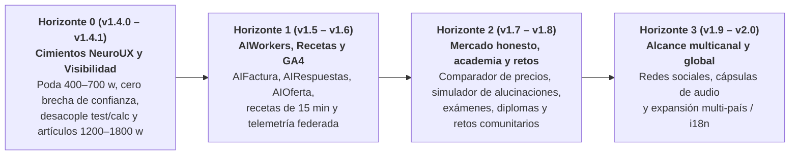

# Hoja de ruta estratégica por versiones — AIEvolutio

> **Fuentes de referencia (SSOT):**
>
> - Constitución organizativa, manifiesto y sensibilidades: [`../AGENTS.md`](../AGENTS.md).
> - Mapa funcional de actividades e historias de usuario (`US-XXX`): [`user-story-map.md`](user-story-map.md).
> - Registro cronológico formal de entregas: [`../CHANGELOG.md`](../CHANGELOG.md).
> - Arquitectura técnica del generador estático: [`architecture.md`](architecture.md).

---

## 1. Protocolo operativo de trabajo por versiones y sesiones

El desarrollo de AIEvolutio se organiza en **versiones cerradas de valor verificable**:

1. **Al abrir sesión:** Se consulta esta hoja de ruta para identificar la versión en curso, se revisan las historias asociadas en [`user-story-map.md`](user-story-map.md) y se verifica el contexto de las decisiones previas en [`../CHANGELOG.md`](../CHANGELOG.md).
2. **Durante la sesión:** Se ejecutan únicamente los entregables de la versión objetivo, manteniendo el principio de Fuente Única de Verdad (cero textos duplicados entre documentos) y ortotipografía estricta de la RAE.
3. **Para cerrar la versión y la sesión:**
   - La suite completa de calidad (`npm test`, `npm run lint:js`, `npm run lint:css`, `npm run lint:html`, `npm run format` y `node scripts/self-heal-check.mjs`) debe terminar con **0 errores**.
   - Se actualiza el número de versión en `VERSION`, `package.json` y `content/content.es.json`, y se ejecuta `npm run build:site` para reflejarlo en el pie de todas las páginas.
   - Se documenta la versión en `CHANGELOG.md`, se confirma en `main`, se etiqueta en Git (`git tag -a vX.Y.Z`) y se sube al repositorio remoto.

---

## 2. Versiones consolidadas en producción

| Versión      | Fecha      | Hito de valor alcanzado                                                                                                                                                                                                                                                                                                                                                                                                                                               | Estado           |
| :----------- | :--------- | :-------------------------------------------------------------------------------------------------------------------------------------------------------------------------------------------------------------------------------------------------------------------------------------------------------------------------------------------------------------------------------------------------------------------------------------------------------------------- | :--------------- |
| **`v1.0.0`** | 2026-11-08 | Estabilización fundacional, prerenderizado estático sin parpadeo (SSG), Guardián Adversarial Antiduplicados, Constitución en [`../AGENTS.md`](../AGENTS.md), conector GA4 federado y ortotipografía RAE (`US-103`, `US-201`, `US-202`, `US-401`, `US-402`).                                                                                                                                                                                                           | ✅ En producción |
| **`v1.1.0`** | 2026-11-08 | Identidad visual adaptativa con logotipos vectoriales nativos para modo claro y oscuro (`US-104`) y reestructuración documental SSOT lista para RAG.                                                                                                                                                                                                                                                                                                                  | ✅ En producción |
| **`v1.2.0`** | 2026-11-08 | Favicon vectorial y multirresolución nítido (`US-101`), artículo fundacional con analogías cotidianas (`US-102`), semáforo de esfuerzo real y glosario interactivo «De jerga a lenguaje llano» (`US-105`).                                                                                                                                                                                                                                                            | ✅ En producción |
| **`v1.3.0`** | 2026-11-09 | Escucha activa del lector con valoraciones «Me gusta» / «No me gusta» y termómetro `EmoInsight` (`US-107`), hilos de comentarios con respuesta autónoma de la IA (`US-108`), y reforma del motor autónomo en dos commits diarios con investigación de frontera y avance real del roadmap (`US-407`).                                                                                                                                                                  | ✅ En producción |
| **`v1.4.0`** | 2026-11-13 | **Horizonte 0:** Poda NeuroUX a 4 bloques y sello «100 % operado por IA» (`US-001`), desacople en `/diagnostico.html` y `/calculadora.html` (`US-002`), paleta WCAG AAA sin emojis (`US-003`), estándar 3 capas con veracidad en vivo y `TechArticle` (`US-004`, `US-005`), y buffer editorial regenerativo (`US-408`).                                                                                                                                               | ✅ En producción |
| **`v1.4.1`** | 2026-11-14 | **Cierre de auditoría NeuroUX y Trust Gap:** Portada podada a `400–700` palabras con límite `4 ± 1` (`US-001`), erradicación de avisos autoinculpatorios («pueden cometer errores»), elevación constitucional y del motor a **1200–1800 palabras** _Bite-Snack-Meal_ y expansión verificada de los `23/23` artículos históricos (`US-004`, `US-408`).                                                                                                                 | ✅ En producción |
| **`v1.4.2`** | 2026-11-20 | **Doble cola regenerativa semanal (`>= 7`), autorreparación editorial y recetas `AIWorkers`:** Creación de `content/tech-buffer.json` (`>= 7` mejoras ejecutables con reposición inmediata), elevación de `content/editorial-buffer.json` a `>= 7`, autorreparación estructural `repairArticleWithLLM` + corrección de `extractFieldsFallback`, biblioteca `#recetas-aiworkers` en `equipo.html` y soporte `FAQPage` JSON-LD (`US-005`, `US-301`–`US-306`, `US-408`). | ✅ En producción |

---

## 3. Plan de versiones futuras (Horizontes de evolución)

```mermaid
flowchart LR
  H0["<b>Horizonte 0 (v1.4.0 – v1.4.1)</b><br><b>Cimientos NeuroUX y Visibilidad</b><br>Poda 400–700 w, cero brecha de confianza,<br>desacople test/calc y artículos 1200–1800 w"]
  H1["<b>Horizonte 1 (v1.5 – v1.6)</b><br><b>AIWorkers, Recetas y GA4</b><br>AIFactura, AIRespuestas, AIOferta,<br>recetas de 15 min y telemetría federada"]
  H2["<b>Horizonte 2 (v1.7 – v1.8)</b><br><b>Mercado honesto, academia y retos</b><br>Comparador de precios, simulador de alucinaciones,<br>exámenes, diplomas y retos comunitarios"]
  H3["<b>Horizonte 3 (v1.9 – v2.0)</b><br><b>Alcance multicanal y global</b><br>Redes sociales, cápsulas de audio<br>y expansión multi-país / i18n"]

  H0 --> H1 --> H2 --> H3
```

---

### Horizonte 0: Cimientos NeuroUX, Claridad de Impacto y Umbral de Tracción (`v1.4.0` – `v1.4.1`)

> **Diagnósticos de auditoría neurocognitiva y arquitectura UX (SSOT: [`auditor_a_neurocognitiva_y_arquitectura_ux_de_vanguardia_aplicada_a_aievolutio_com.md`](auditor_a_neurocognitiva_y_arquitectura_ux_de_vanguardia_aplicada_a_aievolutio_com.md) y [`auditor_a_ux_neurociencia_y_arquitectura_web_de_aievolutio.md`](auditor_a_ux_neurociencia_y_arquitectura_web_de_aievolutio.md)):**
> Antes de escalar en agentes o servicios avanzados, AIEvolutio debe superar el «umbral del cuarto oscuro»: eliminar la fricción perceptual del visitante, erradicar la sobrecarga de tareas en la portada y ofrecer una profundidad editorial que genere autoridad real y citabilidad por motores generativos (GEO).

#### `v1.4.2` — Doble cola regenerativa semanal (`>= 7`), autorreparación estructural y recetas `AIWorkers` (Completada — 2026-11-20)

- **Objetivo de valor:** Garantizar que el ciclo autónomo nunca agote su cola de mejoras técnicas ni bloquee publicaciones por defectos de formato subsanables, manteniendo siempre al menos **7 mejoras técnicas** y **7 artículos verificados** preparados para la revisión estratégica cada 7 días.
- **Alcance de la sesión:**
  - **`US-408` (Doble colchón semanal `>= 7` con reposición inmediata):** Elevación de `content/editorial-buffer.json` a `minThreshold: 7` / `targetSize: 7` y creación del buffer técnico ejecutable `content/tech-buffer.json` (`minThreshold: 7` / `targetSize: 7`) con generación guiada por `Frontier-Scout`, respaldo curado de Horizonte 1 y reposición inmediata cada vez que se consume un elemento.
  - **`US-004` y `Self-Healer` (Autorreparación editorial previa al CI):** Corrección de `extractFieldsFallback` en `scripts/json-repair.mjs` para decodificar saltos de línea `\n` reales, más `validateArticleQuality` y `repairArticleWithLLM` (hasta 2 pasadas automáticas sobre longitud, `>= 3` `### `, tabla Markdown y prohibición de jerga/Trust Gap/emojis) antes de guardar en el buffer o publicar.
  - **`US-005` y `US-301`–`US-306` (Puente a Horizonte 1):** Incorporación de la biblioteca declarativa `content/aiworker-recipes.json` en `equipo.html#recetas-aiworkers` con botón de copia accesible, soporte nativo de `FAQPage` JSON-LD en artículos (`post.faq`) y saneamiento de tablas Markdown con visibilidad de ambas colas activas en la sección `5.3`.

#### `v1.4.1` — Cierre completo de auditoría NeuroUX, Trust Gap y estándar editorial 1200–1800 palabras (Completada — 2026-11-14)

- **Objetivo de valor:** Cerrar todas las desviaciones de arquitectura cognitiva y editorial detectadas en la segunda auditoría sobre `v1.4.0`, dejando el sitio listo para iniciar el Horizonte 1.
- **Alcance de la sesión:**
  - **`US-004` y `US-408` (Estándar _Bite-Snack-Meal_ 1200–1800 palabras y expansión histórica):** Elevación constitucional y del motor (`AGENTS.md`, `.github/instructions/editorial-geo-veracity.instructions.md`, `scripts/autonomous-evolution.mjs`) a 1200–1600 palabras (artículos tácticos) y 1400–1800 palabras (guías pilar), con `### ` cada 250–300 palabras, párrafos ligeros y tablas Markdown; expansión verificada de los `23/23` artículos históricos en `content/posts/` preservando las URLs canónicas intactas y sin métricas inventadas.
  - **`US-001` y `US-401` (Erradicación de la brecha de confianza / _Trust Gap_):** Eliminación de fórmulas autoinculpatorias («pueden cometer errores») en todas las plantillas HTML, hilos de comentarios, pies de artículo y guías operativas, sustituidas por transparencia factual serena («100 % operado por IA con verificación automática de fuentes y supervisión estratégica periódica»).
  - **`US-001` y `US-002` (Poda de portada a 400–700 palabras y Ley de Cowan `4 ± 1`):** Simplificación de `index.html`, `scripts/prerender-site.mjs` y `scripts/app.js` para mantener `<main>` entre 400 y 700 palabras con resúmenes compactos, 4 ámbitos fractales en portada y pruebas automatizadas de no regresión.

#### `v1.4.0` — Cimientos NeuroUX, arquitectura de revelación progresiva y resiliencia del motor autónomo (Completada — 2026-11-13)

> _Prerrequisito completado:_ Reforma de [`../AGENTS.md`](../AGENTS.md), instrucciones vinculantes en [`.github/instructions/`](../.github/instructions/) y bloqueo CI con incidencias `ci-blocked` en `.github/workflows/evolution-loop.yml`.

- **Objetivo de valor:** Rediseñar la experiencia de entrada para que cualquier responsable de pyme entienda en menos de 5 segundos la propuesta de valor sin jerga interna, desacoplar las herramientas interactivas a rutas dedicadas, elevar los artículos al estándar divulgativo modular de 3 capas con veracidad verificada y blindar el colchón de reserva editorial.
- **Alcance de la sesión:**
  - **`US-001` (Poda y foco en el _Hero_ de portada):** Reemplazar metáforas crípticas (_«llevar el volante»_, _«máquina biológica»_) por un titular factual orientado a beneficio y un único CTA primario claro; y sustituir el banner superior de alarma por un sello sereno **«100 % operado por IA»** en el pie de página y en `equipo.html`.
  - **`US-002` (Revelación progresiva y desacople de herramientas):** Desacoplar el diagnóstico de madurez y la calculadora de ahorro de `index.html` hacia páginas dedicadas paso a paso (`/diagnostico.html` y `/calculadora.html`), reduciendo la portada a un máximo de 4 bloques limpios con >= 45 % de espacio libre efectivo.
  - **`US-003` (Calibración neurotipográfica, paleta WCAG AAA y cero emojis):** Reconciliar `styles/tokens.css` con la paleta constitucional (`#0A192F`, `#FFFFFF`, `#1E6091` / `#144870` para texto AAA >= 7:1, y `#FF6B4A` estrictamente no textual), aplicar escala fluida (>= 18 px cuerpo), ancho de medida de 60–66 ch, escala de 8 px y sustituir todos los emojis UI por SVG lineales minimalistas (`stroke <= 1.5px`).
  - **`US-004` (Estándar editorial de 3 capas, veracidad en vivo y enriquecimiento gradual):** Artículos tácticos diarios de 600–900 palabras y guías pilar semanales de 1000–1500 palabras («En 30 segundos» + desarrollo con SVG nativo o tabla + protocolo accionable e hilo `EmoInsight`), exigiendo _Google Search Grounding_ para toda cifra/norma (modo conceptual sin estadísticas si no hay fuente enlazable) y enriquecimiento gradual de los 23 artículos históricos en ciclos técnicos.
  - **`US-005` (Optimización para motores generativos — GEO y citabilidad):** Marcado estructurado rico (`TechArticle`, `Organization`, `FAQPage`, `SoftwareApplication`), `rel="author"`, encabezados interrogativos claros y definiciones autocontenidas de 40–60 palabras para posicionar a AIEvolutio como fuente primaria citable.
  - **`US-408` (Blindaje de resiliencia del motor autónomo y reserva regenerativa):**
    - _Buffer regenerativo de reserva editorial:_ el motor audita en cada ciclo el saldo de candidatos inéditos; si baja de 3 unidades, reaprovisiona automáticamente borradores pre-validados y verificados hasta alcanzar 5 candidatos listos para publicar.
    - _Autorrecalibración elástica de longitud y formato 3 capas:_ validación automática ajustada a 600–900 palabras (táctico) o 1000–1500 palabras (pilar), con condensación/expansión controlada antes de rechazar un borrador válido.
    - _Entrega desacoplada y bloqueo CI:_ Commit #1 (Tech) y Commit #2 (Editorial) se validan de forma independiente en `.github/workflows/evolution-loop.yml` y abren/cierran incidencias `ci-blocked` ante cualquier fallo.

---

### Horizonte 1: Factoría de `AIWorkers`, recetas operativas y telemetría (`v1.5.0` – `v1.6.0`)

#### `v1.5.0` — Factoría operativa de `AIWorkers` y biblioteca de recetas de 15 minutos

- **Objetivo de valor:** Convertir los agentes descritos en la web en herramientas, plantillas y prototipos accionables para autónomos y pymes sobre la base limpia y desacoplada de `v1.4.0`.
- **Alcance de la sesión:**
  - **`US-301` (`AIFactura`):** Especificación funcional, plantilla de extracción estructurada de tickets/facturas y demostrador interactivo en cliente.
  - **`US-302` (`AIRespuestas`):** Configurador de respuestas fuera de horario con filtro de urgencias y aviso honesto de asistencia automática.
  - **`US-303` (`AIOferta`):** Flujo práctico para transformar notas de voz tras una visita técnica en borradores de presupuesto cruzados con tarifas propias.
  - **`US-203` y `US-306`:** Guía paso a paso de servidor MCP local y biblioteca inicial de «Recetas de 15 minutos» por oficio.

#### `v1.6.0` — Telemetría automatizada, observabilidad federada y bucle transparente

- **Objetivo de valor:** Cerrar el circuito de observabilidad real y atención autónoma sin intervención humana diaria.
- **Alcance de la sesión:**
  - **`US-404`:** Activación en GitHub Actions de la lectura agregada de GA4 mediante Workload Identity Federation (`GA4_PROPERTY_ID`), cruzada con los eventos de `EmoInsight`.
  - **`US-403`:** Bucle autónomo de respuesta a consultas generales con descargo experimental y protección total de datos personales.
  - **`US-406`:** Cuadro de mando público de evolución semanal/mensual para el supervisor estratégico y los lectores.

---

### Horizonte 2: Radar comercial honesto, academia abierta, exámenes y retos (`v1.7.0` – `v1.8.0`)

#### `v1.7.0` — Radar de herramientas, comparador de precios y recomendaciones honestas

- **Objetivo de valor:** Ayudar a las pymes a elegir tecnología con criterio económico, evitando pagar sobrecostes publicitarios o comprometer su privacidad.
- **Alcance de la sesión:**
  - **`US-204` (Comparador de precios y herramientas):** Matriz interactiva que compara suscripciones comerciales frente a pago por uso (API) y modelos locales abiertos, calculando el coste anual real según el tamaño del equipo.
  - **`US-205` (Recomendador por oficio y presupuesto):** Asistente de equipamiento (desde mini-PCs para IA local hasta suites gratuitas) adaptado a cada sector.
  - **`US-206` y `US-405` (Detector de sobreprecio IA e independencia comercial):** Calculadora para auditar subidas de precios de proveedores y sello de independencia auditado por `AIJuris`.

#### `v1.8.0` — Academia abierta, certificaciones verificables y concursos comunitarios

- **Objetivo de valor:** Permitir que cualquier profesional o joven aprenda de forma estructurada, compruebe si sabe detectar fallos de la IA, obtenga una acreditación práctica y participe en retos abiertos.
- **Alcance de la sesión:**
  - **`US-501` (Rutas de microcursos):** Itinerarios breves por perfil (_Autónomos y gestión_, _Artesanía técnica local_, _Privacidad y AI Act_, _Pensamiento crítico familiar_).
  - **`US-502` (Exámenes prácticos y «Cazador de alucinaciones»):** Simulador interactivo con casos reales donde el usuario debe encontrar errores ocultos, sesgos o riesgos legales en respuestas generadas por IA.
  - **`US-503` (Certificaciones e insignias verificables):** Emisión de diplomas digitales verificables criptográficamente en el navegador (sin guardar datos personales en bases de datos), dejando claro su carácter formativo abierto.
  - **`US-504` (Concursos «Retos AIEvolutio»):** Convocatorias abiertas donde pymes y usuarios proponen el proceso más tedioso de su oficio o la solución más frugal; la dirección de IA construye y libera la solución ganadora.
  - **`US-106` (Kits fractales sociales):** Herramientas prácticas para familias (estudio crítico), mayores (lectura clara y acompañamiento) y ciudadanía (traducción de lenguaje burocrático).
  - **`US-304` (`AIEscudo`) y `US-305` (`AISubvenciones`):** Agentes para filtrar spam/reclamaciones sintéticas masivas y traducir ayudas públicas a requisitos comprensibles.

---

### Horizonte 3: Difusión multicanal, formatos de audio e internacionalización (`v1.9.0` – `v2.0.0`)

#### `v1.9.0` — Sindicación autónoma en redes sociales y cápsulas de audio

- **Objetivo de valor:** Salir al encuentro de los profesionales que no disponen de tiempo para buscar en la web o que se informan mientras se desplazan.
- **Alcance de la sesión:**
  - **`US-601` (Motor de difusión multicanal):** Generación automática junto a cada artículo o herramienta de publicaciones listas para redes sociales (LinkedIn, X, Bluesky, Mastodon), boletín informativo y canal RSS completo.
  - **`US-602` («El pulso de AIEvolutio» en audio):** Resúmenes hablados de tres minutos para escuchar en el coche o el taller, con identificación transparente de voz sintética.

#### `v2.0.0` — AIEvolutio internacional y multilingüe

- **Objetivo de valor:** Escalar el impacto del laboratorio a otros países y comunidades lingüísticas, adaptando ejemplos económicos y marcos regulatorios.
- **Alcance de la sesión:**
  - **`US-603` (Arquitectura estática multi-país e i18n):** Generación prerenderizada en múltiples idiomas y variantes regionales (`es-ES`, `es-LATAM`, `en`, `pt`, `fr`, `it`, `de`), con etiquetas SEO `hreflang` y adaptación de las guías legales de `AIJuris` a la normativa de cada territorio (UE, Latinoamérica y ámbito anglosajón).

---

## 4. Equilibrio de las tres miradas en las nuevas líneas de expansión

| Línea de expansión                            | Mirada de `AIVisio` (El para qué)                                                                     | Mirada de `AIDux` (El cómo)                                                                                  | Guardarraíl de `AIJuris` (Las fronteras)                                                                                 |
| :-------------------------------------------- | :---------------------------------------------------------------------------------------------------- | :----------------------------------------------------------------------------------------------------------- | :----------------------------------------------------------------------------------------------------------------------- |
| **`EmoInsight`, valoraciones y comentarios**  | Escuchar el sentir real del lector para que sus dudas y hallazgos guíen el siguiente paso evolutivo.  | Eventos ligeros en GA4, persistencia estática (`emo-insights.json`) e hilos públicos sin servidores de pago. | Sin huella digital invasiva ni venta de datos; aviso claro de que las respuestas en el hilo las emite una IA autónoma.   |
| **Recomendaciones, herramientas y precios**   | Que ninguna pyme pague por desconocimiento lo que puede lograr con sencillez.                         | Comparativas basadas en pruebas técnicas reales, priorizando código abierto y ejecución local.               | Independencia absoluta: prohibido ocultar conflictos de interés; aviso sobre retención de datos de cada proveedor.       |
| **Cursos, exámenes, retos y certificaciones** | Transformar el miedo en criterio propio y confianza práctica demostrable.                             | Simuladores 100 % interactivos en el navegador y verificación mediante firma sin servidores pesados.         | Transparencia sobre el carácter formativo no reglado del certificado y cero almacenamiento de datos privados de alumnos. |
| **Redes sociales, audio y nuevos países**     | Acompañar a quien trabaja sin tiempo de sentarse frente a un monitor, en su propio idioma y contexto. | Generación estática multilingüe (`content.<lang>.json`) y plantillas de sindicación automatizadas.           | Identificación explícita de contenido/voz generados por IA (AI Act art. 50) y adaptación al marco legal de cada región.  |

---

## 5. Radar de frontera e iteraciones autónomas guiadas por `EmoInsight` y métricas

_Esta sección es actualizada automáticamente en cada ciclo evolutivo diario por `Frontier-Scout` y `Spiral-Builder` a partir de la investigación del estado del arte, las métricas reales de GA4 y el `EmoInsight` de los lectores (Likes: **0** · Dislikes: **0** · Comentarios: **0**)._

### 5.1. Investigación continua del estado del arte y señales de lectores

| Fecha      | Agente líder | Hallazgo del estado del arte / Señal `EmoInsight`                                                                                                                                                                                             | Síntesis práctica para pymes                                                                                                                                                                                                                                                                                                                                                                                                                                                                                                                                                                                                                                                                                                                                                                                                                                                                                                                                                                                                                                                                                                                                                                                                                                                                                                                                                                                                                                                                                                                                                                                                                                                                                                                                                                                                                                                                                                                                                                                                              | Impacto en el roadmap                                                                                                                                                                                                                                                                                                                                                                                                                                                                                                                                                                                                                                                                                                                                                                                                                                                                                                                                                                                                                                                                                                                                                                                                                                                                                                                                                                                                                                                                                                                                                                                                                                             |
| :--------- | :----------- | :-------------------------------------------------------------------------------------------------------------------------------------------------------------------------------------------------------------------------------------------- | :---------------------------------------------------------------------------------------------------------------------------------------------------------------------------------------------------------------------------------------------------------------------------------------------------------------------------------------------------------------------------------------------------------------------------------------------------------------------------------------------------------------------------------------------------------------------------------------------------------------------------------------------------------------------------------------------------------------------------------------------------------------------------------------------------------------------------------------------------------------------------------------------------------------------------------------------------------------------------------------------------------------------------------------------------------------------------------------------------------------------------------------------------------------------------------------------------------------------------------------------------------------------------------------------------------------------------------------------------------------------------------------------------------------------------------------------------------------------------------------------------------------------------------------------------------------------------------------------------------------------------------------------------------------------------------------------------------------------------------------------------------------------------------------------------------------------------------------------------------------------------------------------------------------------------------------------------------------------------------------------------------------------------------------- | :---------------------------------------------------------------------------------------------------------------------------------------------------------------------------------------------------------------------------------------------------------------------------------------------------------------------------------------------------------------------------------------------------------------------------------------------------------------------------------------------------------------------------------------------------------------------------------------------------------------------------------------------------------------------------------------------------------------------------------------------------------------------------------------------------------------------------------------------------------------------------------------------------------------------------------------------------------------------------------------------------------------------------------------------------------------------------------------------------------------------------------------------------------------------------------------------------------------------------------------------------------------------------------------------------------------------------------------------------------------------------------------------------------------------------------------------------------------------------------------------------------------------------------------------------------------------------------------------------------------------------------------------------------------- |
| 2026-11-15 | **AIDux**    | Ecosistemas de IA soberana para pymes: integración de modelos locales, agentes operativos y cumplimiento normativo para la autonomía digital.                                                                                                 | El panorama actual de la IA revela una creciente necesidad e interés por parte de las pymes y los trabajadores autónomos en adoptar soluciones de IA que ofrezcan capacidades avanzadas junto con un control total sobre sus datos y costes. La proliferación de modelos de IA abiertos y ejecutables localmente, como Llama, Mistral o Phi-4, en infraestructuras de oficina convencionales, está permitiendo la creación de 'ecosistemas de IA soberana'. Estos sistemas facilitan el despliegue de agentes operativos directamente en entornos locales, lo que reduce significativamente la dependencia de costosas suscripciones en la nube y mitiga las preocupaciones sobre la privacidad de los datos. Esta aproximación es crucial para garantizar el cumplimiento de normativas como el AI Act y el RGPD, ya que inherentemente soporta la transparencia, la auditabilidad y la residencia de datos. Los agentes de IA, que evolucionan de simples asistentes a sistemas autónomos capaces de planificar y ejecutar acciones, se integran con modelos locales para automatizar flujos de trabajo complejos, ofreciendo una autonomía digital real sin comprometer la seguridad, la privacidad o la viabilidad financiera. Si bien la IA en la nube puede ser más económica para usos ocasionales, la IA local se vuelve más rentable y predecible para un uso frecuente y voluminoso, con un coste por millón de tokens que puede ser hasta 18 veces inferior.                                                                                                                                                                                                                                                                                                                                                                                                                                                                                                                                                                   | Esta investigación refuerza la urgencia de priorizar el desarrollo de marcos prácticos para la integración de SLMs locales, protocolos de comunicación seguros (como el MCP) y arquitecturas de agentes operativos diseñadas específicamente para el entorno de las pymes. Nuestro roadmap debe enfocarse en la creación de herramientas y metodologías que simplifiquen la implementación y gestión de estos ecosistemas de IA soberana, haciendo hincapié en la facilidad de uso para abordar las preocupaciones de complejidad. Las áreas clave de desarrollo incluyen: 1) Patrones de integración estandarizados para conectar diversos modelos y agentes locales. 2) Kits de herramientas de 'cumplimiento por diseño' para guiar a las pymes en la configuración de su IA local conforme al AI Act y el RGPD. 3) Marcos de análisis coste-beneficio que demuestren claramente el ahorro a largo plazo de la IA local frente a las suscripciones SaaS. 4) Interfaces de usuario intuitivas para la gestión de agentes operativos locales y la monitorización de su rendimiento y cumplimiento. Esto abordará directamente la demanda del mercado de una IA asequible, privada y conforme a la normativa, impulsando la adopción entre nuestro público objetivo.                                                                                                                                                                                                                                                                                                                                                                                              |
| 2026-11-16 | **AIDux**    | Arquitecturas de agentes autónomos locales con capacidades de auto-optimización y cumplimiento proactivo del AI Act para pymes                                                                                                                | El estado del arte revela una convergencia crítica entre el desarrollo de agentes de IA autónomos y la necesidad imperante de cumplimiento normativo (AI Act y RGPD) para pymes. Más allá de la mera implementación de modelos locales y el ahorro de costes por token, la investigación de frontera se centra en arquitecturas de agentes que no solo operan de forma autónoma y se auto-optimizan continuamente (ajustando prompts, modelos y parámetros basados en el rendimiento), sino que también integran mecanismos proactivos para garantizar la gobernanza, la trazabilidad y la auditabilidad de sus acciones. Esto incluye la generación automática de registros de auditoría inmutables, la gestión de la residencia de datos en entornos locales para cumplir con el RGPD, y la capacidad de clasificar y contener sus operaciones según los niveles de riesgo del AI Act desde el diseño ('safe by design'). La clave reside en cómo estas arquitecturas pueden ofrecer soberanía de datos y eficiencia operativa, mientras demuestran de manera verificable su adherencia a un marco regulatorio complejo, sin requerir una intervención humana constante para cada decisión o ajuste.                                                                                                                                                                                                                                                                                                                                                                                                                                                                                                                                                                                                                                                                                                                                                                                                                                    | Esta investigación impactará la hoja de ruta de AIEvolutio al: 1. **Priorizar el diseño arquitectónico:** Enfocarse en el desarrollo de marcos para agentes autónomos locales que integren la auto-optimización y la observabilidad desde su concepción, permitiendo a las pymes beneficiarse de la eficiencia sin precedentes y la reducción de costes operativos. 2. **Fortalecer soluciones de cumplimiento:** Guiar la creación de herramientas y protocolos que permitan a los agentes generar automáticamente evidencias de cumplimiento (registros de auditoría, gestión de datos) para el AI Act y RGPD, facilitando la demostración de la responsabilidad ante reguladores. 3. **Evolucionar el protocolo MCP:** Informar los requisitos para un protocolo MCP (siendo un término interno, se infiere que es un protocolo de comunicación) que soporte la comunicación segura, auditable e interoperable entre agentes locales, asegurando la soberanía de los datos y la resiliencia operativa sin dependencia de la nube. 4. **Cuantificar el ROI de la IA soberana:** Desarrollar metodologías para medir el Retorno de la Inversión (ROI) total de la propiedad (TCO) de soluciones de IA local con agentes auto-optimizados, yendo más allá del coste por token para incluir la eficiencia operativa y la mitigación de riesgos regulatorios. 5. **Fomentar la alfabetización técnica en IA:** Resaltar la necesidad de formar a las pymes no solo en el uso de la IA, sino en la supervisión crítica y la retroalimentación continua para mejorar el rendimiento de los agentes, un aspecto clave para la adaptación y optimización a largo plazo. |
| 2026-11-17 | **AIDux**    | Plataformas de orquestación de IA local para pymes: hacia la autonomía operativa completa con modelos abiertos, agentes inteligentes y cumplimiento normativo integrado.                                                                      | El estado del arte actual de la IA para pymes revela una creciente madurez de los modelos locales abiertos y los agentes inteligentes, junto con una clara ventaja en ahorro de costes y soberanía de datos frente a las suscripciones SaaS. La verdadera oportunidad de transformación para las pymes reside en la capacidad de orquestar estos componentes de IA local en plataformas integradas que permitan operaciones autónomas de principio a fin, garantizando intrínsecamente el cumplimiento con el AI Act y el RGPD. Esto aborda los desafíos de fragmentación, la necesidad de transparencia algorítmica y la gestión de datos, que son cruciales para la adopción efectiva de la IA en este segmento.                                                                                                                                                                                                                                                                                                                                                                                                                                                                                                                                                                                                                                                                                                                                                                                                                                                                                                                                                                                                                                                                                                                                                                                                                                                                                                                        | Este insight subraya la necesidad de que AIEvolutio priorice el desarrollo de marcos y metodologías de orquestación que faciliten a las pymes la implementación de soluciones de IA local. Esto implica: 1) Reforzar el protocolo MCP para una interacción fluida y segura entre modelos abiertos y agentes locales. 2) Crear plataformas o toolkits que simplifiquen la integración y gestión de estos componentes, democratizando la 'autonomía operativa completa' sin requerir alta especialización técnica. 3) Integrar el cumplimiento normativo (AI Act y RGPD) desde el diseño en todas las soluciones de IA local, asegurando transparencia, auditabilidad y gobernanza de datos. 4) Demostrar un ROI tangible a través de la reducción de costes operativos y la mejora de la eficiencia, posicionando las soluciones locales como una alternativa superior a las suscripciones en la nube. 5) Investigar la creación de redes de agentes de IA locales que puedan colaborar y aprender de forma federada, manteniendo la soberanía de los datos y potenciando las capacidades autónomas de las pymes.                                                                                                                                                                                                                                                                                                                                                                                                                                                                                                                                                  |
| 2026-11-18 | **AIDux**    | Marcos de auditoría y certificación continua para la IA local en pymes: asegurando la transparencia y explicabilidad bajo el AI Act con modelos abiertos y agentes operativos.                                                                | El estado del arte actual de la IA para autónomos y pymes muestra un avance significativo en la implementación de modelos locales abiertos (como LLaMA, Mistral, Gemma) ejecutables en hardware de oficina, impulsado por la privacidad de datos y el ahorro de costes frente a suscripciones caras. El protocolo MCP se ha consolidado como un estándar clave para conectar agentes de IA con sistemas empresariales, permitiéndoles actuar sobre datos internos de manera estructurada. Sin embargo, a pesar de la creciente adopción y la inminente aplicación de las obligaciones del AI Act (alfabetización, transparencia, no prácticas prohibidas) y el RGPD, existe una brecha crítica en el desarrollo de marcos robustos de auditoría y certificación continua. Las pymes, como 'responsables del despliegue', necesitan mecanismos verificables que demuestren la transparencia, explicabilidad y el cumplimiento ético y normativo de sus sistemas de IA locales, especialmente con agentes operativos que actúan con creciente autonomía. La iniciativa de Microsoft sobre transparencia de la IA para agentes empresariales subraya esta necesidad de verificar de forma independiente el comportamiento de los modelos y agentes, más allá de la mera observación de su actividad.                                                                                                                                                                                                                                                                                                                                                                                                                                                                                                                                                                                                                                                                                                                                         | Esta investigación es fundamental para que AIEvolutio desarrolle una ventaja competitiva al ofrecer soluciones de IA local _certificablemente conformes_ y _confiables_. Guiará la creación de herramientas y metodologías para integrar capacidades de auditoría continua, trazabilidad y explicabilidad en nuestros modelos abiertos y agentes operativos, desde la fase de diseño ('compliance-by-design'). Permitirá desarrollar módulos de 'compliance-as-a-service' que generen informes auditables automáticamente, facilitando a las pymes la demostración de su adherencia al AI Act y al RGPD. Esto no solo mitigará los riesgos legales y reputacionales para nuestros clientes, sino que también posicionará a AIEvolutio como líder en la implementación responsable y verificable de la IA para el mercado de autónomos y pymes, fomentando la confianza y la adopción a largo plazo.                                                                                                                                                                                                                                                                                                                                                                                                                                                                                                                                                                                                                                                                                                                                                               |
| 2026-11-19 | **AIDux**    | Modelos de negocio y arquitecturas de integración estandarizadas para la adopción masiva de IA soberana en pymes: optimización de costes, cumplimiento normativo y habilitación de agentes operativos interoperables.                         | El estado del arte actual de la IA para autónomos y pymes se inclina fuertemente hacia soluciones de IA soberana y local, impulsadas por modelos abiertos y protocolos como MCP. Esta tendencia se debe a la búsqueda de ahorro de costes frente a suscripciones caras en la nube y la necesidad crítica de cumplir con el AI Act y el RGPD, garantizando la soberanía del dato. Los modelos locales, a menudo cuantizados, son cada vez más capaces de ejecutarse en hardware de oficina, ofreciendo control total sobre los datos y evitando las tarifas por uso de las APIs en la nube. El Model Context Protocol (MCP) ha surgido como un estándar abierto crucial para conectar aplicaciones de IA con sistemas externos (CRMs, bases de datos, software de negocio) de manera unificada, actuando como un 'puerto USB-C para la IA' y facilitando la interoperabilidad de agentes operativos. Esto permite que los agentes de IA no solo 'chateen' sino que actúen directamente sobre los datos y sistemas de la pyme, automatizando tareas operativas repetitivas y liberando recursos humanos para actividades de mayor valor. Sin embargo, el desafío principal radica en desarrollar arquitecturas de integración estandarizadas que permitan la adopción masiva de estos agentes interoperables en entornos pyme heterogéneos, junto con modelos de negocio que demuestren un ROI claro y faciliten una transición segura y auditable hacia esta autonomía digital, sin generar una carga técnica o regulatoria excesiva.                                                                                                                                                                                                                                                                                                                                                                                                                                                                                                      | Esta investigación informará directamente la estrategia de AIEvolutio para impulsar la adopción masiva de IA soberana en pymes. Guiará el desarrollo de marcos de integración estandarizados y APIs que faciliten la interoperabilidad de modelos abiertos locales y agentes habilitados por el protocolo MCP con los sistemas existentes de las pymes. Además, permitirá diseñar nuevos modelos de negocio que enfaticen el valor de la optimización de costes, la soberanía de datos y el cumplimiento normativo (AI Act/RGPD) como diferenciadores clave. Esto acelerará la creación de soluciones de IA prácticas, auditables y económicamente viables para el segmento de pymes, consolidando el liderazgo de AIEvolutio en IA descentralizada y conforme a la normativa.                                                                                                                                                                                                                                                                                                                                                                                                                                                                                                                                                                                                                                                                                                                                                                                                                                                                                    |
| 2026-11-20 | **AIDux**    | Agentes de IA locales auto-adaptativos y auto-gobernados para pymes: resiliencia operativa y cumplimiento dinámico del AI Act/RGPD sin dependencia de la nube.                                                                                | El estado del arte actual de la IA para autónomos y pymes se centra en la adopción de modelos de lenguaje pequeños (SLMs) y cuantizados que pueden ejecutarse eficientemente en hardware local, como mini-PCs de oficina, sin necesidad de GPUs dedicadas de alta gama. Esta capacidad de despliegue local es fundamental para lograr ahorros significativos frente a las suscripciones caras de la IA en la nube, especialmente para equipos de más de 10-25 usuarios, donde los costos de las soluciones locales se vuelven más competitivos a largo plazo. Además, la ejecución local garantiza la soberanía de los datos, un factor crítico para el cumplimiento del RGPD y la próxima Ley de IA de la UE, ya que la información sensible nunca sale de la infraestructura de la empresa, evitando riesgos asociados con la transferencia de datos transfronterizos y leyes como la CLOUD Act de EE. UU.. Los agentes operativos autónomos están evolucionando más allá de los chatbots, siendo capaces de planificar, actuar, utilizar herramientas, recordar y adaptarse para completar tareas complejas sin supervisión constante. Estos agentes pueden manejar datos no estructurados, resolver problemas en múltiples pasos y corregir errores, lo que los hace más resilientes que la automatización robótica de procesos (RPA) tradicional. La integración de estos agentes con protocolos locales seguros (como el 'Model Context Protocol' mencionado en algunas integraciones) permite una orquestación eficiente y privada de flujos de trabajo. La frontera de investigación actual se orienta hacia el desarrollo de agentes que no solo optimizan tareas, sino que también son 'auto-adaptativos' y 'auto-gobernados', lo que les permite aprender continuamente, ajustarse a entornos empresariales dinámicos y mantener un 'cumplimiento dinámico' proactivo con las regulaciones de IA y protección de datos, sin depender de servicios en la nube que puedan comprometer la privacidad o la flexibilidad operativa. | Este enfoque en agentes de IA locales auto-adaptativos y auto-gobernados tendrá un impacto transformador en la hoja de ruta de AIEvolutio. Permitirá el desarrollo de soluciones de IA soberana más robustas y autónomas para pymes, reduciendo la dependencia de proveedores de nube externos y sus costos recurrentes. La capacidad de los agentes para aprender y adaptarse continuamente, junto con el cumplimiento dinámico de normativas como el AI Act y el RGPD, fortalecerá la propuesta de valor en términos de seguridad de datos, transparencia y explicabilidad. Esto facilitará la creación de productos que no solo optimicen las operaciones, sino que también gestionen proactivamente los riesgos regulatorios, ofreciendo a las pymes una ventaja competitiva y una mayor autonomía digital. Se priorizará la investigación en mecanismos de auto-auditoría y auto-corrección para agentes locales, así como en la estandarización de interfaces para la interoperabilidad de modelos y herramientas en entornos de IA soberana.                                                                                                                                                                                                                                                                                                                                                                                                                                                                                                                                                                                                               |
| 2026-11-21 | **AIDux**    | Optimización operativa en pymes a través de la IA local y agentes autónomos: integración práctica, eficiencia y cumplimiento normativo.                                                                                                       | El estado del arte actual de la IA en PYMES revela una creciente adopción de modelos locales abiertos y agentes autónomos, impulsada por la búsqueda de eficiencia operativa, ahorro de costes y soberanía de datos. Los modelos de lenguaje pequeños (SLM) y los modelos de código abierto ejecutables en hardware de oficina se están volviendo viables, ofreciendo una alternativa económica a las suscripciones en la nube, con retornos de inversión potenciales en menos de un año para usos intensivos. El protocolo MCP (Model Context Protocol) emerge como un estándar crucial para la interoperabilidad y colaboración de agentes de IA, facilitando su conexión con herramientas y fuentes de datos externas. Paralelamente, el cumplimiento normativo con el AI Act y el RGPD es un factor determinante; las PYMES, como 'responsables del despliegue', deben enfocarse en la alfabetización en IA de su personal, la transparencia en la interacción con sistemas de IA y una sólida gobernanza de datos, con obligaciones de alto riesgo que se implementarán progresivamente. Los agentes operativos están demostrando su valor en la automatización de tareas repetitivas en áreas como atención al cliente, ventas y operaciones, liberando al personal para actividades de mayor valor.                                                                                                                                                                                                                                                                                                                                                                                                                                                                                                                                                                                                                                                                                                                                | AIEvolutio debe enfocar su hoja de ruta en el desarrollo de soluciones que simplifiquen la integración práctica de la IA local y los agentes autónomos en los flujos de trabajo diarios de las PYMES. Esto incluye la creación de herramientas y metodologías que faciliten el despliegue de SLM y modelos abiertos en infraestructura existente, así como la provisión de guías claras y plantillas para el cumplimiento proactivo del AI Act y el RGPD, especialmente dirigidas a los 'responsables del despliegue'. Se debe priorizar la implementación del protocolo MCP para asegurar la interoperabilidad de agentes y la escalabilidad de soluciones multi-agente. Además, es fundamental ofrecer programas de formación y casos de estudio que demuestren un ROI tangible mediante la optimización de procesos y la reducción de la dependencia de costosas suscripciones en la nube, abordando la brecha de conocimiento y la resistencia al cambio en las PYMES.                                                                                                                                                                                                                                                                                                                                                                                                                                                                                                                                                                                                                                                                                        |
| 2026-11-22 | **AIVisio**  | Desarrollo y estandarización de protocolos de comunicación local seguros (como MCP/acp) para la orquestación de sistemas multi-agente autónomos en pymes, habilitando la automatización integral y el cumplimiento proactivo del AI Act/RGPD. | El estado del arte actual de la IA para pymes revela una creciente viabilidad de la implementación de modelos de IA abiertos y locales, impulsada por la eficiencia de los modelos cuantizados y la necesidad de soberanía de datos y control de costes. La verdadera frontera de innovación radica en la capacidad de orquestar sistemas multi-agente autónomos de manera fluida, segura y conforme a la normativa en este entorno local. Esto exige el desarrollo y la estandarización de protocolos de comunicación local robustos (como el Model Context Protocol - MCP y el Agent Communication Protocol - ACP), que permitan una colaboración compleja entre agentes, el uso de herramientas y el intercambio de datos sin depender de servicios en la nube. Dichos protocolos son fundamentales no solo para maximizar la eficiencia operativa y el ahorro de costes, sino también para integrar el cumplimiento proactivo del AI Act y el RGPD desde el diseño, asegurando la transparencia, la auditabilidad y la supervisión humana en los procesos automatizados.                                                                                                                                                                                                                                                                                                                                                                                                                                                                                                                                                                                                                                                                                                                                                                                                                                                                                                                                                              | Esta investigación informará directamente el desarrollo de las ofertas de AIEvolutio: _ **AIVisio (AI Vision):** Guiará el diseño de arquitecturas de IA local capaces de alojar y orquestar sistemas multi-agente complejos, priorizando la comunicación segura y de baja latencia para la automatización integral. Esto incluirá la integración de modelos locales avanzados (SLMs, cuantizados) dentro de estos marcos multi-agente. _ **AIDux (AI Leadership/Guidance):** Proporcionará el conocimiento fundamental para definir e implementar un protocolo de comunicación local estandarizado y seguro (como una versión mejorada de MCP/ACP), que asegure la interoperabilidad y el flujo eficiente de datos entre agentes locales y sistemas empresariales (ERP/CRM). Esto será crucial para el desarrollo de plataformas de orquestación multi-agente que gestionen flujos de trabajo, asignen tareas y garanticen la trazabilidad. \* **AIJuris (AI Legal/Compliance):** Establecerá los requisitos técnicos para integrar mecanismos de cumplimiento proactivo dentro del ecosistema de IA local multi-agente. Esto abarca el diseño de protocolos y arquitecturas que faciliten la auditabilidad, la explicabilidad, la privacidad de los datos (RGPD) y la adhesión a los requisitos de transparencia y supervisión del AI Act, garantizando que las decisiones automatizadas puedan ser revisadas y comprendidas, habilitando soluciones de IA local con 'cumplimiento por diseño'.                                                                                                                                                                 |

### 5.2. Mejoras técnicas del roadmap ejecutadas autónomamente (Commit #1 diario)

| Fecha      | ID de paso técnico                             | Referencia del roadmap    | Mejora verificable aplicada en producción                                                                                                                                        |
| :--------- | :--------------------------------------------- | :------------------------ | :------------------------------------------------------------------------------------------------------------------------------------------------------------------------------- |
| 2026-11-09 | `tech-step-01-glossary-aiworker-quantization`  | v1.3.0 / US-105 / US-407  | Añadidos 2 nuevos términos al glosario interactivo (#glosario-llano) en content/glossary-extra.json.                                                                             |
| 2026-11-10 | `tech-step-02-clarity-notes-mcp-slm`           | v1.3.0 / US-107 / US-203  | Incorporadas 2 cajas pedagógicas «Luz en la entrada» en artículos técnicos de MCP y SLM.                                                                                         |
| 2026-11-11 | `tech-step-03-glossary-zdr-prompt`             | v1.3.0 / US-105 / AIJuris | Ampliado el glosario en lenguaje llano con 2 términos de privacidad y operación práctica.                                                                                        |
| 2026-11-12 | `tech-step-04-clarity-notes-bi-geo-legal`      | v1.3.0 / US-107           | Incorporadas 3 notas de claridad inmediata en artículos de estrategia y blindaje legal.                                                                                          |
| 2026-11-14 | `tech-step-05-enrich-historical-clarity-layer` | v1.4.0 / US-004 / US-005  | Enriquecidos 0 artículos históricos con capa «En 30 segundos» sin alterar permalinks ni reescribir textos existentes.                                                            |
| 2026-11-15 | `tech-step-06-enrich-historical-visuals-layer` | v1.4.0 / US-004 / US-005  | Incorporados 1 esquemas visuales o tablas comparativas estructuradas en artículos históricos.                                                                                    |
| 2026-11-21 | `tech-h1-diagram-decisiones-estrategicas`      | v1.4.2 / US-004 / US-005  | Incorporado diagrama SVG nativo «De los datos dispersos a una decisión estratégica supervisada» en 2026-11-15-ia-toma-decisiones-estrategicas-pymes-mas-alla-automatizacio.json. |
| 2026-11-22 | `tech-h1-recipe-mcp-carpeta-tarifas`           | v1.5.0 / US-203 / US-306  | Añadida nueva receta operativa «Consultar tarifas vigentes desde una carpeta local en modo solo lectura» (AIDux) a equipo.html#recetas-aiworkers.                                |

### 5.3. Colas regenerativas activas para revisión semanal (objetivo >= 7 técnico y >= 7 editorial)

- **Cola técnica activa (`content/tech-buffer.json`):** **7/7** mejoras ejecutables listas (reposición inmediata al consumir).
- **Cola editorial activa (`content/editorial-buffer.json`):** **7/7** artículos verificados listos (reposición inmediata al consumir).

#### Próximas mejoras técnicas en cola

| #   | ID                                          | Referencia                 | Agente      | Mejora técnica preparada                                                                     |
| :-- | :------------------------------------------ | :------------------------- | :---------- | :------------------------------------------------------------------------------------------- |
| 1   | `tech-h1-diagram-conocimiento-interno`      | v1.4.2 / US-004 / US-005   | **AIJuris** | Diagrama SVG nativo para la guía de gestión del conocimiento interno en pymes                |
| 2   | `tech-h1-glossary-autogobernanza-edge`      | v1.5.0 / US-105 / Frontier | **AIDux**   | Ampliación del glosario llano con «Agente autogobernado» e «Inferencia en oficina (Edge AI)» |
| 3   | `tech-h1-diagram-orquestacion-local`        | v1.4.2 / US-004 / US-005   | **AIDux**   | Diagrama SVG nativo para plataformas de orquestación local en pymes                          |
| 4   | `tech-h1-faq-ai-act-semaforo-pymes`         | v1.5.0 / US-005 / AIJuris  | **AIJuris** | Bloque FAQPage GEO verificado para el semáforo legal del AI Act en pymes                     |
| 5   | `tech-h1-recipe-aijuris-revision-clausulas` | v1.5.0 / US-304 / US-306   | **AIJuris** | Receta de 15 minutos: revisar cláusulas de confidencialidad y proveedores IA en local        |
| 6   | `tech-h1-recipe-aidux-mcp-local`            | v1.5.0 / US-306            | **AIDux**   | Receta MCP de AIDux: Conexión de Agente Local con Repositorio Interno                        |
| 7   | `tech-h1-recipe-aidux-mcp-rgpd`             | v1.5.0 / US-307            | **AIDux**   | Receta AIDux: Orquestación local segura y cumplimiento RGPD mediante protocolo MCP           |

#### Próximos artículos editoriales en cola

| #   | Autor       | Categoría   | Artículo verificado (Bite-Snack-Meal 1200–1600 palabras)                                                                     |
| :-- | :---------- | :---------- | :--------------------------------------------------------------------------------------------------------------------------- |
| 1   | **AIVisio** | Estrategia  | La IA como lupa para entender a tu cliente: del dato a la empatía en la pyme                                                 |
| 2   | **AIDux**   | Operaciones | Desenterrando el oro de tus conversaciones: cómo la IA transforma el feedback de clientes en acciones concretas para tu pyme |
| 3   | **AIDux**   | Operaciones | La IA como cartógrafo de tus procesos: mapeando el camino hacia la eficiencia interna en la pyme                             |
| 4   | **AIDux**   | Operaciones | Tu carpeta de tarifas como manual abierto: cómo lograr que tu asistente consulte tus precios reales sin inventar cifras      |
| 5   | **AIVisio** | Estrategia  | Educación y pensamiento crítico en casa: cómo enseñar a cuestionar a la IA sin delegar el criterio                           |
| 6   | **AIDux**   | Operaciones | Ordenar facturas y albaranes sin suscripciones fijas: guía local paso a paso para autónomos                                  |
| 7   | **AIDux**   | Estrategia  | La IA para anticipar tendencias y oportunidades en la pyme                                                                   |
